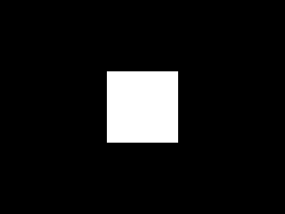
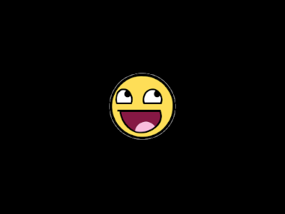
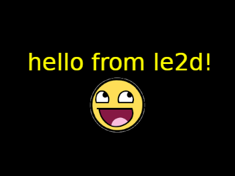

# Getting Started

## Game Loop

The most basic use of `le2d` is to create a window and use Dear ImGui in a game(-like) loop.

```cpp
// create a Context instance.
auto context = le::Context{};

// loop while context is running (ie, window is open).
while (context.is_running()) {
  // start the next frame. This polls events and waits for any
  // previous renders on the virtual frame to complete.
  context.next_frame();

  // this is the 'tick' / 'update' section.
  ImGui::ShowDemoWindow(); // or draw your own ImGui widgets.

  // submit the frame for presentation.
  context.present();
}
```

### Window Customization

`le::Context` takes a (default constructed) `le::ContextCreateInfo` argument, using which the window parameters (among other things) can be customized. Use `le::FullscreenInfo` for a (borderless) fullscreen window instead.

```cpp
// all members are constexpr-friendly.
static constexpr auto context_create_info_v = le::Context::CreateInfo{
  .window = le::WindowInfo{.size = {400, 300}, .title = "My Window"},
};
auto context = le::Context{context_create_info_v};
// ...
```

## Drawing Shapes

Drawing a quad is fairly straightforward: create a `le::drawable::Quad` instance outside the game loop so that its properties persist across frames (it is also lightweight enough to be created/destroyed every frame), start the primary render pass each frame, and issue the draw call. ImGui will be drawn in a separate post-pass, the order of the primary / custom passes vs `ImGui::XYZ()` commands does not matter.

```cpp
// ...
// create a quad.
auto quad = le::drawable::Quad{};
quad.create({100.0f, 100.0f});

// loop while context is running (ie, window is open).
while (context.is_running()) {
  // start the next frame. This polls events and waits for any
  // previous renders on the virtual frame to complete.
  context.next_frame();

  // begin the primary render pass.
  if (auto renderer = context.begin_render()) {
    // draw quad.
    quad.draw(renderer);
  } // Renderer's destructor will call end_render().
  // It can also be explicitly/redundantly called inside the if block.

  // submit the frame for presentation.
  context.present();
}
```



## Handling Events

Events are encoded as a variant in `le::Event`. `le::Context` (and its underlying `le::RenderWindow`) maintain an event queue which should be iterated every frame.

```cpp
// ...
context.next_frame();

for (auto const& event : context.event_queue()) {
  // handle events here.
  // for example, if you want to close the window on Escape key press:
  if (auto const* key_event = std::get_if<le::event::Key>(&event)) {
    if (key_event->key == GLFW_KEY_ESCAPE && key_event->action == GLFW_PRESS) {
      context.shutdown(); // set the close flag.
    }
  }
}

// ...
```

Note that `le::Context::shutdown()` doesn't immediately close the window, it just sets the close flag so that `le::Context::is_running()` returns `false` in the next game loop iteration. The same flag is set when the user clicks X / requests the window to be closed, and can thus be unset, eg for quit confirmation.

### Delta Time

`kvf::DeltaTime` can be used to track frame time in a central place:

```cpp
auto context = le::Context{context_create_info_v};

// create a DeltaTime instance.
auto delta_time = kvf::DeltaTime{};
// ...
while (context.is_running()) {
  // ...
  // compute the delta time (in float seconds).
  auto const dt = delta_time.tick();
  // ...
}
```

## Using Assets

Assume the following file structure in the working directory:

```
assets
├── audio
│   └── explode.wav
├── fonts
│   └── Vera.ttf
└── images
    └── awesomeface.png
```

A `le::FileDataLoader` instance can be used to load binary data from files in `assets/`, and an `le::AssetLoader` instance to load asset types using any data loader:

```cpp
// create a FileDataLoader instance, mounting the assets directory.
auto const data_loader = le::FileDataLoader{"assets"};

// create an AssetLoader instance.
// This is a cheap, (mostly) stateless, utility wrapper.
auto asset_loader = le::AssetLoader{&data_loader, &context};

// wait for the context to be idle before destroying any resources.
context.wait_idle();
```

### Drawing a Textured Quad

Load the texture, then simply assign its pointer to `quad.texture`. It should be evident that textures must outlive drawables that use them:

```cpp
// ...
// load the image as a Texture.
auto texture = asset_loader.load_texture("images/awesomeface.png");

// ...
quad.texture = &texture;
// ...
```



### Drawing Text

Text can be drawn via `le::drawable::Text`. Naturally, it requires a loaded `le::Font`. First make room by pushing the quad up, and set its texture to the loaded one:

```cpp
// ...
// load the Font.
auto font = asset_loader.load_font("fonts/Vera.ttf");

// ...
// reposition it and set the loaded texture.
quad.transform.position.y -= 30.0f;
quad.texture = &texture;

// create a Text instance.
auto text = le::drawable::Text{};
text.set_string(font, "hello from le2d!");
// reposition and tint it.
text.transform.position.y += 30.0f;
text.tint = kvf::yellow_v;
// ...
```

Add the text instance to the draw list:

```cpp
// ...
quad.draw(renderer);
// draw text.
text.draw(renderer);
// ...
```



### Playing Sounds

Audio is loaded as `capo::Buffer` assets. One-shot sound effects can be fired-and-forgotten through `le::IAudio::play_sfx()`, whereas for music you would want to control playback, volume, etc by owning an Audio Source returned by `le::IAudio::create_source()`.

```cpp
// load the audio file as a capo::Buffer.
auto audio_buffer = asset_loader.load_audio_buffer("audio/explode.wav");
// store playback trigger data.
auto audio_wait = kvf::Seconds{2.0f};
auto audio_played = false;

// ...
// update audio playback.
audio_wait -= dt;
if (audio_wait < 0s && !audio_played) {
  // play the loaded audio buffer.
  context.get_audio().play_sfx(&audio_buffer);
  audio_played = true;
}
```

Needless to say, audio buffers must outlive playback if used through raw pointers. The option to pass a copy of a `std::shared_ptr` also exists.
